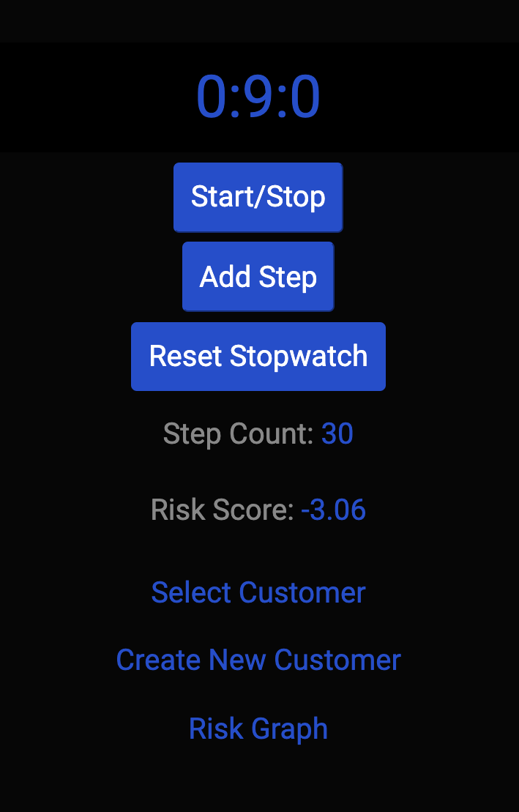
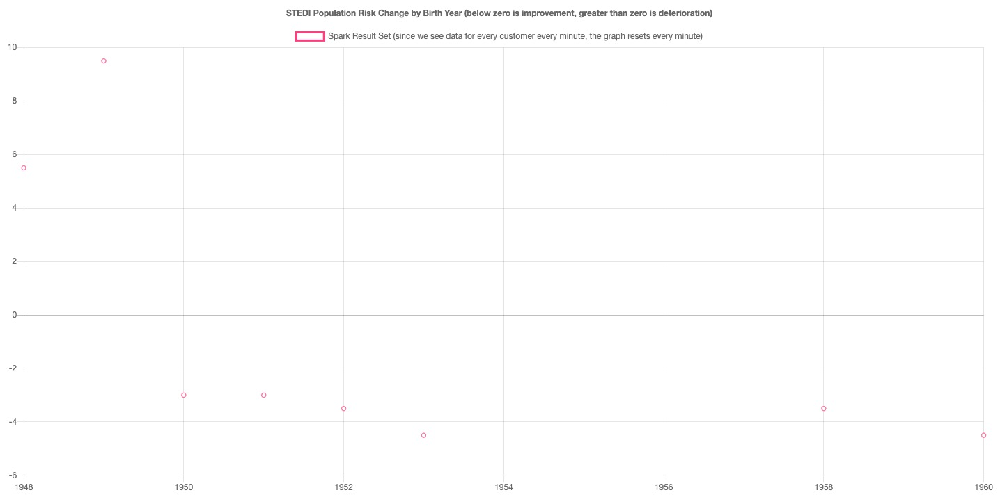
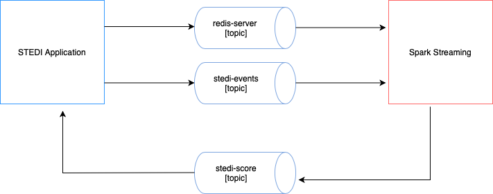

## Project Overview
<br/>

*STEDI* is a small startup focused on assessing balance for seniors.
STEDI has an application that collects data from seniors during a small exercise. The user logs in and then selects the customer they are working with. Then the user starts a timer and clicks a button with each step the senior takes. When the senior has reached 30 steps, their test is finished. The data transmitted enables the application to monitor seniors’ balance risk.

#### STEDI Application
<br/>


<hr/>    
<br/>

## A New Product Feature
<br/>

Your product manager has requested a graph that shows fall risk (will they fall and become injured?) for recent assessments. The development team has built a graph, which is ready to receive risk information from Kafka:

<br/>


<br/>

## The Data
<br/>

The STEDI data science team has configured some real-time data sources using Kafka Connect. One of those data sources is **Redis**. When a customer is first assessed in the STEDI application, their record is added to a sorted set called Customer in Redis. Redis is configured as a Kafka source and whenever any data is saved to Redis (including Customer information), a payload is published to the Kafka topic called redis-server.

Sample data payload from redis to kafka topic (redis-server):

```
{"key":"__Customer__",
"existType":"NONE",
"Ch":false,
"Incr":false,
"zSetEntries":[{
"element":"__{"customerName":"Sam Test","email":"sam.test@test.com","phone":"8015551212","birthDay":"2001-01-03"}",
"Score":0.0
}__],
"zsetEntries":[{
"element":"{"customerName":"Sam Test","email":"sam.test@test.com","phone":"8015551212","birthDay":"2001-01-03"}",
"score":0.0
}]
}
```


## The Challenge

The application development team has programmed certain business events to be published automatically to Kafka. Whenever a customer takes an assessment, their risk score is generated, as long as they have four or more completed assessments. The risk score is transmitted to a Kafka topic called stedi-events as a JSON object with this format:

```
{"customer":"Jason.Mitra@test.com","score":7.0,"riskDate":"2020-09-14T07:54:06.417Z"}
```
The application development team was not able to complete the feature as the graph is currently not receiving any data. Because the graph is currently not receiving any data, you need to generate a new payload in a Kafka topic and make it available to the STEDI application to consume.
<br/>

## Project Architecture
<br/>
<br/>


## Topics and Scripts Used 

- redis-server Topic: first spark script sparkpyrediskafkastreamtoconsole.py to subscribe to the redis-server topic, base64 decode the payload, and deserialize the JSON to individual fields, then print the fields to the console. The data should include the birth date and email address. You will need these.

- stedi-events Topic: second spark script sparkpyeventskafkastreamtoconsole.py to subscribe to the stedi-events topic and deserialize the JSON (it is not base64 encoded) to individual fields. You will need the email address and the risk score.

- stedi-score New Topic: final spark script sparkpykafkajoin.py to join the customer dataframe and the customer risk dataframes, joining on the email address. Create a JSON output to the newly created kafka topic you created for STEDI to subscribe to that contains at least the fields below:

```
{"customer":"Santosh.Fibonnaci@test.com",
 "score":"28.5",
 "email":"Santosh.Fibonnaci@test.com",
 "birthYear":"1963"
} 

This data is used by Risk Graph feature to plot average fall risk in given year

```

